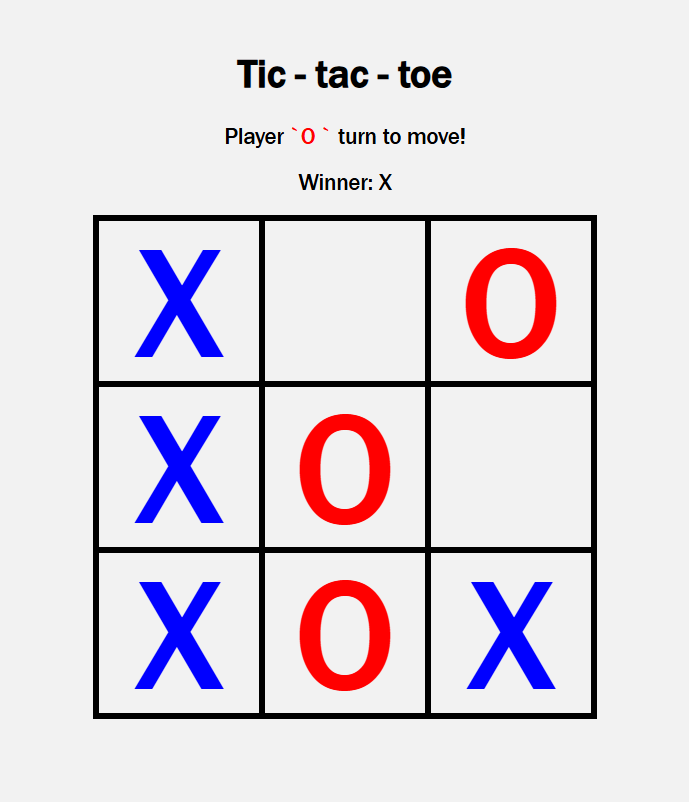

# PHP TicTacToe

## A local web-based Tic-Tac-Toe game built with PHP, Typescript, and Twig.

This project is a primitive tic-tac-toe project with the focus on furthering my knowledge on full stack web technologies. The primary objective is to understand how to use PHP for server-side knowledge, AJAX for asynchronous data communication between the front-end and back-end, Typescript for type-safe front-end scripting, and Twig for seperating PHP code from HTML via. efficient templating.

## Prerequisites

Make sure you have the following installed on your system:

- **Node.js**: [Download Node.js](https://nodejs.org)
- **Composer**: [Download Composer](https://getcomposer.org)
- **PHP**: Make sure PHP is installed and configured.

## Installation & Run Locally

### 1. Download or clone this project to your desired directory.

To clone, run:

```bash
git clone https://github.com/PrimarisEquilibrium/PHP-TicTacToe.git
cd PHP-TicTacToe
```

### 2. Install Front-End Dependencies:

```bash
npm install
```

### 3. Install Back-End Dependencies

```bash
composer install
```

### 4. Run the server

Run `start-server.bat` or run `php -S localhost:8080` in your terminal (at project root) and navigate to http://localhost:8080/src/index.php

## Screenshots


